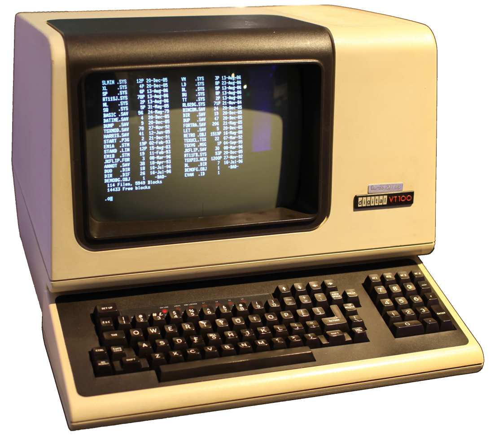

### Lesson 0 - The Terminal & Git

Writing code is only one of the many tasks computer programers must become proficient in to be able to do anything useful. There is a whole suite of technologies you must learn, depending on how you are planning to exercise your programming knowledge.

We'll begin this course by understanding how we interact with our computer through a terminal, and how to download new technologies (software).

#### 0.1 - The Operating System

The "OS" is system software that manages computer hardware, software resources, and provides common services for computer programs.

Such services include input/output from devices (keyboard, mouse...), low level access to the network (i.e. Internet) through something called sockets, the ability to start and stop programs, and many,  **MANY**... more.

Basically, the OS is a service that is always running on your computer, and it provides computer users and programmers with enough abstraction such that they don't need to know anything about how their computer works in order to use it!

> Computer Abstraction Layers - [source](https://en.wikipedia.org/wiki/Operating_system)

Take a look at the image above. If you have no experience with programming, so far you have only interacted with your computer/machine as a user. Throughout this course, you will learn to write application software, such that you can tell your computer what you want it to do.

#### 0.2 - The Terminal

A "terminal" is an electronic device that is used for entering data into, and displaying or printing data from, a computing system.

> DEC VT100 Terminal - [source](source: https://en.wikipedia.org/wiki/Computer_terminal)

Modern operating systems (MacOS X, Windows, Ubuntu...) include a terminal emulator (simulator) program. Physical hardware terminals as shown in the image above are no longer used in practice.

Throughout this course we will learn to navigate the terminal and communicate with our computer system so as to read, write, or execute computer programs.

### Open your terminal and try the following commands:

* `pwd`: Print Working Directory

This command will tell you where in your file system you are currently at (e.g. /Users/You, /Desktop, ...).

* `ls`: List (Files/Directories)

This command will list the files in your current working directory

* `cd`: Change Directory

This command will change your working directory to the directory given as the first argument. Example: `cd directory_name`

* `mkdir`: Create Directory

This command will create a directory at the location given with the name given. Example `mkdir directory_name`

* `touch`: Create File

This command will create a directory at the location given with the name given. Example `mkdir directory_name`

#### 0.3 - The OS Package Manager

// TODO: Download Python

// TODO: Download Git

// clone this repository

