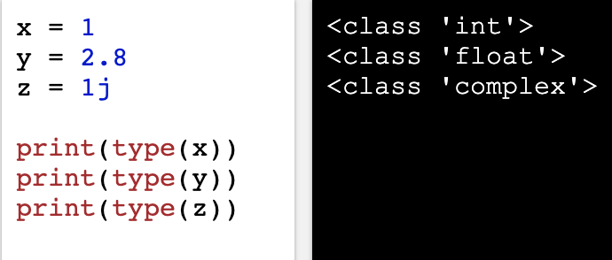

### Lesson 1 - Diving Into Python

Enough computer systems background for now, lets dive into the code.

### Contents

* [1.0 - Python Files](#10---python-files)
* [1.1 - Your First Python Program](#11---your-first-python-program)
* [1.2 - Literal Types](#12---literal-types)
* [1.3 - input() and print() Functions](#13---input-and-print-functions)
* [1.4 - Numeric Operators](#13---input()-and-print()-functions)

## 1.0 - Python Files

Python files are typically named with the `.py` file extension. That is, python files are named as `file.py`.

Make your first python file with the Unix command to create a file:

```
$ touch hello-world.py
```

To edit the file you will need a text editor. For beginners learning python, I recommend [PyCharm](https://www.jetbrains.com/pycharm/).

> Note that text editors are no different than say, Microsoft Word. You can go ahead and write code there, but I wouldn't recommend it. Text editors are designed to help you write software by including common programming utilities like error checking, running code, formatting, etc.

You can download PyCharm with brew:

```
brew cask install pycharm
```

## 1.1 - Your First Python Program

Open, the file you've just created in your favorite text editor.

Type the following statement into the file:

```
print("Hello, World!")
```

Save the changes to the file, and run the code inside PyCharm -- you can figure that one out.

Alternatively, you can also run the python file from the command line (terminal) as follows:

```
$ python hello-world.py
```

Horray! You wrote (and ran) your first program! Throughout the rest of this lesson we will cover the very basics of Python.

 
## 1.2 - Literal Types

In this section we will examine built-in types, also called literals. These are *things* that we use to define real world occurences when writing software.

For example, to represent 10 apples, the **integer** 10 can be used. To represent $15.99 dollars, the **floating-point** 15.99 can be used. To represent the name Adriano, the **string** "Adriano" can be used, and so on.

Later on we will look at more complex types such as lists and custom types.

### Boolean:

Booleans represent one of two values - True or False

Type the following lines into a new file - `booleans.py`:

```
print(10 > 9)
print(10 == 9)
print(10 < 9)
```

What do you think will be printed when you run the program?
Try it out!

Soon you will realize that `True` is printed whenever the statement is true, and `False` whenever it is not.

These "booleans" will come in handy later on when we look at looping and conditional (if/else) statements.

### Numbers:

There are three numeric types in Python:

* **Int:** or integer, is a whole number, positive or negative, without decimals, of unlimited length.

* **Float:** or "floating point number" is a number, positive or negative, containing one or more decimals.

* **Complex:** are written with a "j" as the imaginary part:

Type the following lines into a new file - `numbers.py` and run it:

```
x = 1
y = 2.8
z = 1j

print(x)
print(y)
print(z)
```

Can you distinguish between integer, float, and complex numbers?

Note that you can find the type of a variable by using the ```type(variable)``` function as follows (output on right):



### Strings:

String literals in python are surrounded by either single quotation marks, or double quotation marks.

```'hello'``` is the same as ```"hello"```.

Type the following lines into a new file - `strings.py` and run it:

```
a = "Hello"
print(a)
```

## 1.3 - input() and print() Functions

To output data from any python program, we use the print() function. To input data into a program, we use input(). This function reads a single line of text, as a string.

Here's a program that reads the user's name and says Hello to them:

```
print('What is your name?')
name = input()
print('Hello ' + name + '!')
```

## 1.4 - Numeric Operators

Here's a table of the arithmetic operators (math you can do) for numeric types in python:

|   Operator    |  Description  |Example|
| -------- |:-----------:| :-------:|
| + (add)    | Adds values on either side of the operator.|c = a + b|
| - (subtraction) |	Subtracts right hand operand from left hand operand. | c = a – b| 
| * (multiplication) |	Multiplies values on either side of the operator | c = a * b |
| / (division	) | Divides left hand operand by right hand operand |	c = b / a |
| % (modulus) | Divides left hand operand by right hand operand and returns remainder|	c = b%a |
| ** (exponent) | Performs exponential (power) calculation on operators | c = a ** b | 
| // (floor div.) | The division of operands where the result is the quotient in which the digits after the decimal point are removed. But if one of the operands is negative, the result is floored, i.e., rounded away from zero (towards negative infinity) | 	9//2=4  -11//3=-4 |

> Note that the `+` operator will concatenate strings rather than 'add them' such that:
>
```
print("hello," + " world!")
```
> will print:
```
hello, world!
```

Here's a table of the comparative operators for numeric types in python:

|   Operator    |  Description  |Example|
| :--------: |:-----------:| :-------:|
| == |	If the values of two operands are equal, then the condition becomes true. |	(a == b) is not true |
| != | If values of two operands are not equal, then condition becomes true. | (a != b) is true |
| >	 | If the value of left operand is greater than the value of right operand, then condition becomes true. |	(a > b) is not true. |
| < | 	If the value of left operand is less than the value of right operand, then condition becomes true. |	(a < b) is true. |
| >= |	If the value of left operand is greater than or equal to the value of right operand, then condition becomes true. |	(a >= b) is not true. |
| <= |	If the value of left operand is less than or equal to the value of right operand, then condition becomes true. |	(a <= b) is true. |

**See the file in this directory called `numops.py`. Read through the code and run the program -- get familiar with the mathematics and comparisons you can do with the python programming language.**

Note that there are many assignment and bitwise operators that we did not cover above. 

In the next section we will get into python conditional statements and loops.
